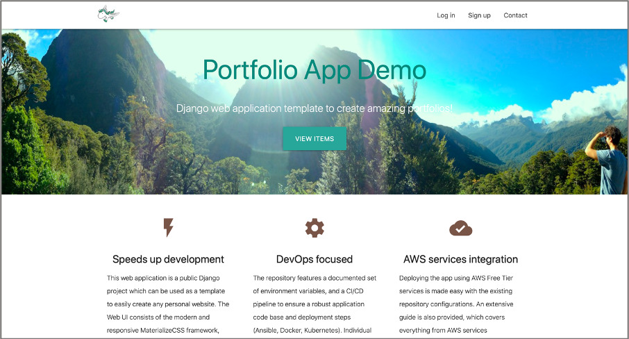
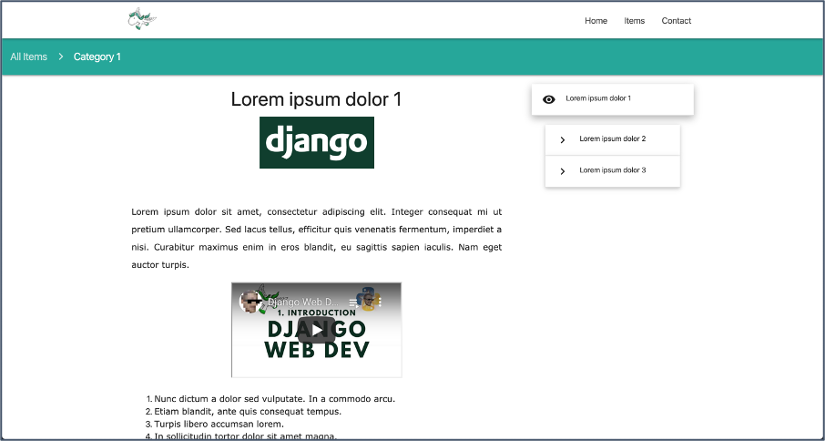
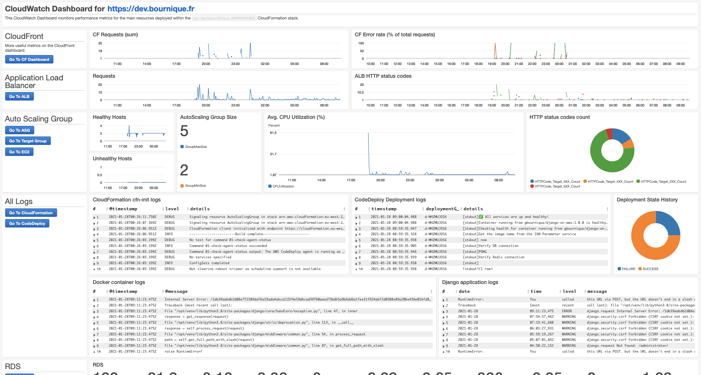
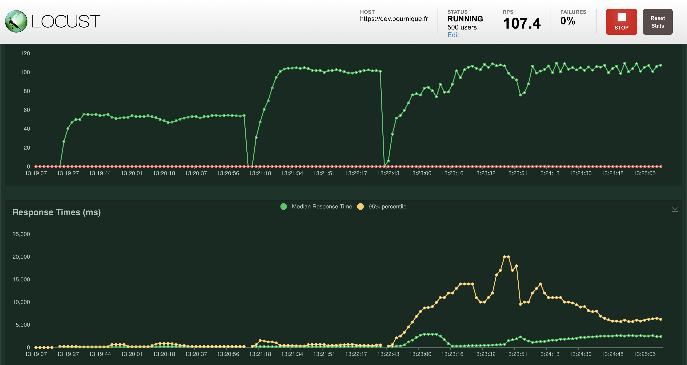
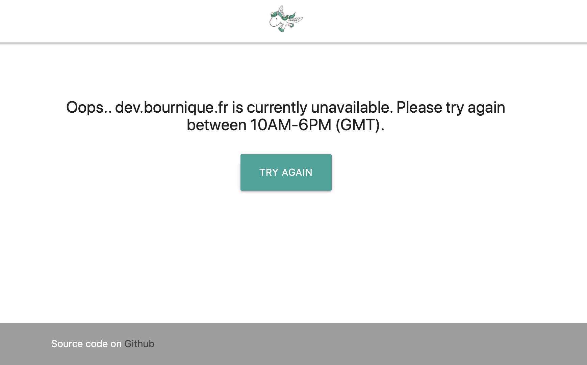
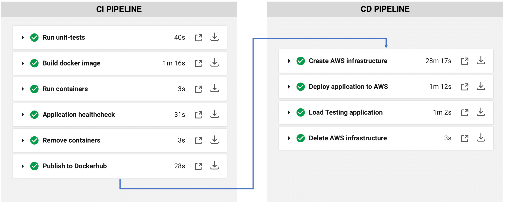

[](https://circleci.com/gh/gbourniq/django-on-aws)
[](https://github.com/pre-commit/pre-commit)


[](https://github.com/psf/black)
[](https://github.com/gbourniq/django-on-aws/blob/master/LICENSE)

## Overview

#### Speeds up development
This project demonstrates how a sample blog-like django webapp can be deployed to the AWS Cloud. The website static content, ie. items and categories data, is managed through the Django admin panel. The application features a user registration system for users to subscribe to new content notifications.

#### AWS services architecture
A microservices architecture approach was implemented using AWS managed services, with the ability to auto-scale a dynamic fleet of EC2 instances based on demand and schedule. Network and compute performance metrics can be monitored via a custom AWS CloudWatch Dashboard.

#### Infrastructure as code
Dev deployment: Use of Terraform and Ansible playbooks for ad-hoc deployments of the dockerised application with local databases.
Prod deployment: Use of nested AWS CloudFormation templates to create a prodution grade infrastructure [AWS infrastructure]("https://github.com/gbourniq/django-on-aws/blob/main/.github/app-architecture.png"), including AWS managed databases. Application deployment to a running fleet of EC2 instances via the AWS CodeDeploy service. Automated weekly CI/CD pipeline to test the application code, infrastructure code, and deployment scripts.

<p align="center">
  
  <i>AWS services architecture</i>
</p>

## Content

The README covers the following topics:
- The sample django web application itself, configured for a Postgres database backend and Redis cache
- AWS CloudFormation templates, to create and manage AWS infrastructure environments (dev/uat/prod)
- AWS CodeDeploy scripts, to deploy new application versions to a fleet of running EC2 instances
- CI/CD pipeline with CircleCI
- Makefile to automate common tasks

Details can be found in these individual sections.
- [Application overview](#application-overview)
- [Local development](#local-development)
	- [Prerequisites](#Prerequisites)
	- [Virtual environment and git-hooks setup](#Virtual-environment-and-git-hooks-setup)
	- [Run django webserver locally and unit-tests](#Run-django-webserver-locally-and-unit-tests)
	- [Build, test, and publish docker image](#build-test–and-publish-docker-image)
	- [Run the application container on a remote server with Terraform and Ansible](#run-the-application-container-on-a-remote-server-with-terraform-and-ansible)
- [AWS deployment](#aws-deployment)
	- [Create AWS infrastructure from CloudFormation templates](#Create-AWS-infrastructure-from-CloudFormation-templates)
	- [Webapp deployment with AWS CodeDeploy](#Webapp-deployment-with-AWS-CodeDeploy)
	- [CloudWatch Dashboard to monitor application](#CloudWatch-Dashboard-to-monitor-application)
	- [Webapp Load Testing](#Webapp-Load-Testing)
	- [EC2 Auto Scaling and cost considerations](#EC2-Auto-Scaling-and-cost-considerations)
	- [Disaster recovery](#Disaster-recovery)
	- [Webapp failover page](#Webapp-failover-page)
- [CI/CD pipeline](#cicd)

## Application overview

The Django application consists of a sample blog-like website which can be used as a personal portfolio. The website static content, namely items and categories data, are managed through the `Django admin panel`.

The applicate features a user registration system for anyone willing to receive notifications whenever new content is added.

Some screenshots of the UI:
<p align="center">
  
  <i>Homepage</i>
  <br><br>
  
  <i>Items view page</i>
  <br><br>
  
  <i>Django admin page and login page (Mobile view)</i>
  <br><br>
</p>

## Local development

#### Main directories and files
```
django-on-aws
├── app/                        <-- Django app, staticfiles, logs, unit-tests
├── deployment/
│   ├── aws
│   │   ├── cloudformation/     <-- CloudFormation templates
│   │   └── codedeploy-app/     <-- CodeDeploy scripts
│   └── local                   <-- Configuration files to run the app and containers locally
├── environment.yml             <-- Conda environment
├── pyproject.toml              <-- Python dependencies managed by poetry
├── .pylintrc                   <-- Pylint configurations (python formatting)
├── .pre-commit-config.yaml     <-- Pre-commit githooks
├── Dockerfile                  <-- Instructions to create the application docker image
├── docker-compose.yml          <-- Spin up Postgres and Redis containers for local dev
├── .circleci/config.yml        <-- CI/CD Pipeline
├── Makefile                    <-- Automate common tasks, eg. app management/deployment
└── utils/                      <-- Helpers scripts
```

### Prerequisites
- Install [Docker](https://hub.docker.com/search/?type=edition&offering=community)
- Install [Miniconda](https://docs.conda.io/en/latest/miniconda.html) 
- Install [Poetry](https://github.com/sdispater/poetry)
- Install [Make](https://www.gnu.org/software/make/)

### Virtual environment and git-hooks setup

The following make commands are available:
```
make env                         <-- Set conda environment and install poetry dependencies
make env-update                  <-- Update dependencies
make pre-commit                  <-- Install git-hooks hooks (setup once)
```

> The git-hooks are managed by the [pre-commit](https://pypi.org/project/pre-commit/) package and defined in `.pre-commit-config.yaml`. They automatically format the code with `autoflake`, `isort` and `black`, and run code analysis and unit-tests with `pylint` and `pytest`, on each commit.

### Run django webserver locally and unit-tests

For development purposes, use the following commands:
```bash
make start_db                    <-- Start postgres & redis containers
make runserver                   <-- Start django app locally
pre-commit run --all-files       <-- Lint all files
pytest app -x                    <-- Run unit tests
make cov                         <-- Open unit-tests coverage html report
make clean                       <-- Stop and remove all containers
```

> To run the unit tests outside of docker, use `POSTGRES_HOST=localhost REDIS_ENDPOINT=localhost:6379 pytest app -x`

To run the dockerised app locally:
```bash
make build                       <-- Builds docker image used to run CI steps
make up                          <-- Start dockerised django webserver + postgres/redis
./build_steps/ci.sh healthcheck  <-- Ensure webapp container is up and running
make clean                       <-- Stop and remove all containers
```

### Run the application container on a remote server with Terraform and Ansible

Terraform and ansible files located in `./deployment/dev/` can be used to quickly create an ec2 instance (or multiple) using Terraform code, and deploy the docker image to the server via Ansible playbooks. Note these commands are not covered by the CI/CD pipeline and are mainly intended for a quick ad-hoc deployment testing.

```
make tf-deploy            <-- TF creates EC2s, generates Ansible inventory file for Ansible to install packages, git clone repo, docker pull images and run the app
make tf-destroy           <-- TF destroys all created infrastructure
```

> To configure terraform and ansible, please review the `deployment/dev/README.md` file.

## AWS Deployment

### Create AWS infrastructure from CloudFormation templates

<p align="center">
  
  <i>Application architecture</i>
</p>

The repository contains nested cloudformation templates to easily create the infrastructure illustrated above, using the `awscli` command line interface.

> Note that all AWS resources defined in this architecture *should* be covered by the [AWS Free Tier](https://aws.amazon.com/free/).

Resources are grouped into separate nested (child) cloudformation templates under the `deployment/cloudformation/` directory.

```
cloudformation
├── parent-stack.yaml
├── compute
│   └── template.yaml
├── dashboard
│   └── template.yaml
├── database
│   └── template.yaml
├── network
│   └── template.yaml
├── serverless
│   ├── src
│   │   ├── codedeploy_lambda_handler.py
│   │   ├── sns_lambda_handler.py
│   │   └── sqs_lambda_handler.py
│   └── template.yaml
└── storage
    └── template.yaml
```

Before creating the cloudformation stack, the following prerequisites must be completed manually in the AWS Console:
1. Create Route 53 Hosted Zone ($0.50/month)
2. Create a domain in Route53, eg. mydomain.com (~$15/year)
3. Create a free Amazon Issued public SSL certificate in ACM for both the root domain and sub domains, e.g. `mydomain.com` and `*.mydomain.com`. Must be created in us-east-1 to be in the same region as cloud front. 
4. Create a AWS SES Domain and SES Identity to enable email notifications to registered users (optional)
5. Update parameters in `deployment/prod/cloudformation/parameters.json`
6. Build the CI docker image: `./build_steps/ci.sh build`.
7. Create the following AWS SSM Parameters to store variables used for deployment: `/RDS/POSTGRES_PASSWORD/SECURE` (type: SecureString) and `/SLACK/INCOMING_WEBHOOK_URL` (type: String)

The aws resources can then be deployed as a CloudFormation stack by simply running the `CFN_STACK_NAME=live ./build_steps/cd.sh cfn_create` command.

> Note it can take up to 30mn for all resources to be created. The stack resources can then be updated with `./build_steps/cd.sh cfn_update` or deleted with `./build_steps/cd.sh cfn_destroy`.

### Webapp deployment with AWS CodeDeploy

Deploying the application to a fleet of running EC2 instances is relatively straightforward using the AWS CodeDeploy service, which leverages multiple deployment and rollback configurations.

Application deployment scripts can be found under the `deployment/codedeploy-app/` directory.

```
codedeploy-app
├── appspec.yml                  <-- Used by CodeDeploy to manage deployments
├── scripts
│   ├── 1_stop_server.sh         <-- Gracefully stop the currently running application
│   ├── 2_before_install.sh      <-- Preinstall tasks
│   ├── 3_after_install.sh       <-- Configuration tasks after the new files are copied to the host
│   ├── 4_start_server.sh        <-- Docker pull the new image and run it
│   └── 5_validate_service.sh    <-- Ensure new deployment is successful
└── startup_server.sh            <-- Script copied to the host & mounted to the container
```

Run the following commands to deploy or update a new application version.
```
./build_steps/ci.sh build
./build_steps/ci.sh push_images
./build_steps/ci.sh put_ssm_vars
./build_steps/cd.sh code_deploy
``` 

> Note that CodeDeploy is currently set up to update one instance at a time, while keeping a minimum of 50% healthy hosts. Deployment configurations can be found in `deployment/cloudformation/compute/template.yaml` under `# CodeDeploy`.

### Backups and data migrations

To backup the postgres data and django media files, run the `make backup` command. Restore instructions will be printed in the terminal as part of the command output.


### CloudWatch Dashboard to monitor application

The `cloudformation/dashboard/template.yaml` template defines the following custom AWS CloudWatch Dashboard.

<p align="center">
  
  <i>CloudWatch Dashboard</i>
</p>


The dashboard offers a central location where application deployment and performance issues can be investigated through a number of charts:
- CloudFront metrics (requests, % error rate)
- ALB requests and HTTP status codes
- AutoScaling Group Mix/Max/Desired size
- Target Group heatlhy hosts
- Average CPU utilization of running EC2 instances
- Logs: CloudFormation cfn-init, CodeDeploy agent, Docker container, and Django application logs
- RDS and ElastiCache metrics

> Additionally, the CloudFront service itself provides a number of useful charts, such as Popular Objects requested, Viewers details (device, OS, browser, country), and Cache hit/misses statistics.

### Webapp Load Testing

The conda environment is provisioned with the `locust` python package to run load testing, ensuring the deployed application handles "real-world" traffic conditions.

<p align="center">
  
  <i>Load testing UI, started with the `./build_steps/cd.sh load_testing` command</i>
</p>

### EC2 Auto Scaling and cost considerations

The Auto Scaling group (currently defined in the `deployment/cloudformation/compute/template.yaml` template) uses of `ScheduledAction` resources behind the scenes to fully scale down the website at night by terminating all EC2 instances. 

Using `ScheduledActions` can also achieve significant cost savings by scaling the number of instances appropriately when increased or reduced traffic is anticipated.

Additionally, a `ScalingPolicy` resource has been implemented, and triggers auto scaling events so that the average CPU across running instances is around 60% (configurable).


### Disaster recovery

Automated failover disaster recovery is currently not implemented due to the cost implications. 
A manual disaster recovery approach ("Backup and Restore") should achieve the following RPO/RTO:
* `Recovery Point Objective` is estimated to be around 5mn (RDS automated backup)
* `Recovery Time Objective` is estimated to be around 30mn (time it takes to re-create the whole infrastructure in another region) + time for the database recovery)

### Webapp failover page
If the website is unavailable, Route53 will failover traffic to an S3 website-enabled bucket reachable behind CloudFront. This is a simple HTML page intended to inform the user.

<p align="center">
  
  <i>Failover page (hosted on S3)</i>
</p>

> Note the website can be unreachable for two reasons: the AutoScaling Group is fully scaled down, for eg. by a ScheduledAction at night, or there is an application failure and the load balancer does not return 200 status code responses.


## CI/CD

The `.circleci/config.yml` file configures the following CI/CD pipeline

<p align="center">
  
  <i>CI/CD pipeline</i>
</p>

The CI pipeline only is triggered on every push to the `master` branch, while the full CI-CD pipeline is run on a weekly schedule as configured in the CircleCI file.

Considerations
* The last CD Pipeline step "Delete the AWS infrastructure" takes a few seconds because this is an asynchronous call to the CloudFormation service in order to save up build time.
* It is good to note that CloudFormation can sometimes fail to delete a stack, for example it can't delete a non-empty S3 bucket, and such failure will not appear in CircleCI.

Note the following secret environment variables must be configured in the CircleCI project settings.
```
DOCKER_PASSWORD                  <-- docker login to push image to Dockerhub (ci pipeline)
AWS_ACCESS_KEY_ID                <-- used by the awscli (cd pipeline)
AWS_DEFAULT_REGION               <-- used by the awscli	(cd pipeline)
AWS_SECRET_ACCESS_KEY            <-- used by the awscli	(cd pipeline)
```
> To troubleshoot the pipelines locally, run `make ci-all` and `make cd-all`.